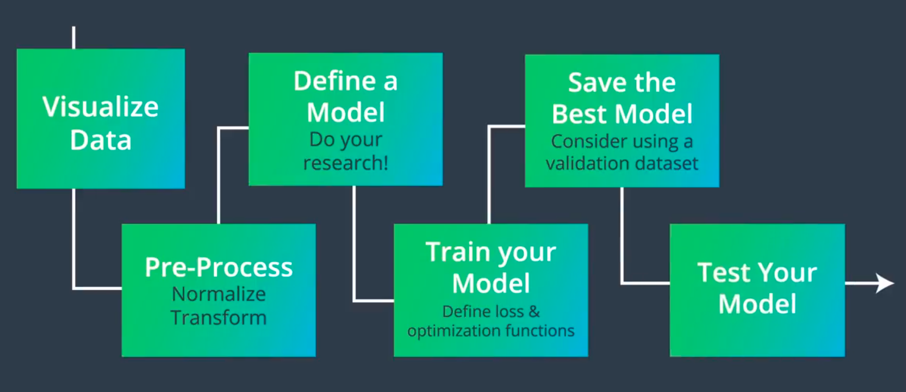

<h1 style='color:#1E3D7F'>Deep Learning Map</h1>

</img>

<ul>
<li>
<a href="./0_html/0_DL_root.html"><b style='font-size:20px;color:#333'>Keras</b></a> 
</li>

<li>
<a href="./0_html/pytorch/0_Torch_Root.html"><b style='font-size:20px;color:#333'>PyTorch 1.3</b></a> 
</li>

<li>TensorFlow 2.0</li>

<li>
<a href="./0_html/fastai/0_fast_root.html"><b style='font-size:20px;color:#333'>FastAI v1.0</b></a> 
</li>
</ul>

