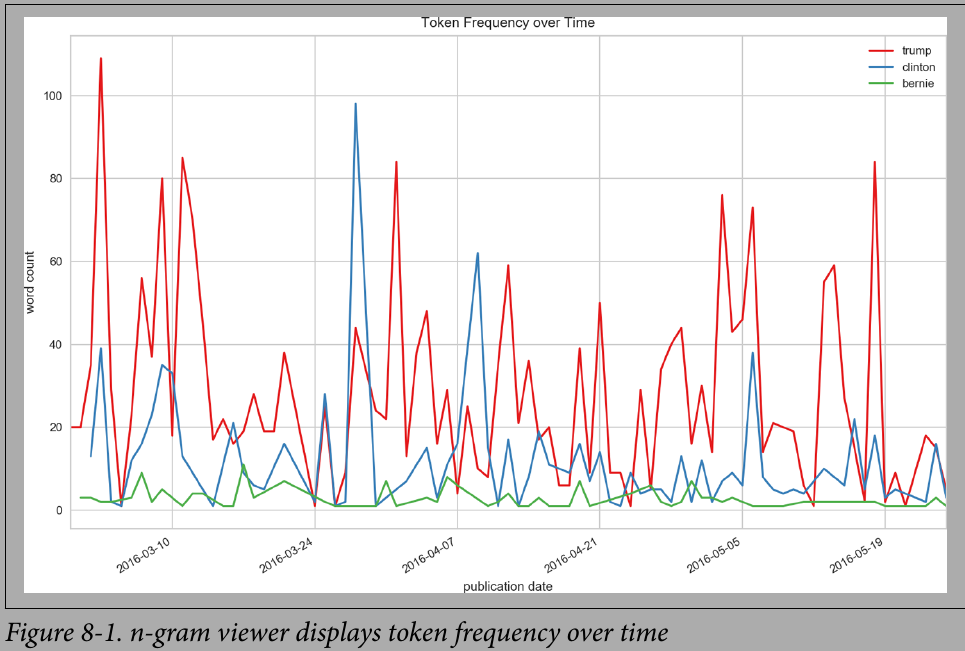

#  EDA

<div style='width:1000px;margin:auto'>

<details><summary><b style="font-size:20px">n-gram Viewer with Time</b></summary>

```
fig, ax = plt.subplots(figsize=(9,6))

for term in terms:
	data[term].plot(ax=ax)
	
ax.set_title("Token Frequency over Time")
ax.set_ylabel("word count")
ax.set_xlabel("publication date")
ax.set_xlim(("2016-02-29","2016-05-25"))
ax.legend()
plt.show()

# NOTE: If you don't have time column, you can display it with index, but convert it to bag-of-words first.
```
<p></p>
</details>

<details><summary><b style="font-size:20px">Network Visualization</b></summary>

Visualize the relationship between each pair of words.
<h4>1. Create the corpus</h4>
```
import itertools

corpus = []
for sentence in df['sample'].values:
    corpus.extend(sentence.split())

def cooccurrence(corpus):
    possible_pairs = list(itertools.combinations(corpus, 2))
    cooccurring    = dict.fromkeys(possible_pairs, 0)
    for idx, current_token in enumerate(corpus):
        if (idx+1 < len(corpus)) and (tuple((current_token, corpus[idx+1])) in possible_pairs):
            cooccurring[(current_token, corpus[idx+1])] += 1
    return cooccurring

pairs = cooccurrence(corpus)
```
<h4>2. Create the network</h4>
```
import networkx as nx

G = nx.Graph()
G.name = "The Social Network of tokens"

# pairs = cooccurrence(corpus)
for pair, wgt in pairs.items():
    if wgt > 0:
        G.add_edge(pair[0], pair[1], weight=wgt)

# Make some the center!
# TODO: WRITE YOUR WORD OF INTEREST HERE!!
D = nx.ego_graph(G, "corona")
edges, weights = zip(*nx.get_edge_attributes(D, "weight").items())

# Push nodes away that are less related to that specific word.
pos = nx.spring_layout(D, k=.5, iterations=40)
nx.draw(D, pos, node_color="gold", node_size=50, edgelist=edges,
        width=.5, edge_color="orange", with_labels=True, font_size=12)
plt.show()
```
</details>

<details><summary><b style="font-size:20px">Heatmap</b> b/w <b style="font-size:20px">Tokens</b></summary>

<h4>1. Create the Matrix</h4>
```
specific_tokens = ['kill', 'corona', 'viris', 'hi', 'symptoms', 'the', 'treatment']

corpus = []
for sentence in df['sample'].values:
    corpus.append(sentence.split())

def cooccurrence_mtx(corpus, specific_tokens=None, sort_alpha=False):
    if sort_alpha: specific_tokens = sorted(specific_tokens)
    possible_pairs = list(itertools.permutations(specific_tokens, 2))
    cooccurring    = dict.fromkeys(possible_pairs, 0)

    for idx, current_sample in enumerate(corpus):
        for pair in possible_pairs:
            if pair[0] in current_sample and pair[1] in current_sample:
                cooccurring[pair] += 1

    pairs = cooccurring.copy()
    mtx = pd.DataFrame(columns=["p1", "p2", "count"])
    for pair, weight in pairs.items():
        mtx = mtx.append({"p1":    pair[0],
                        "p2":    pair[1],
                        "count": float(weight)}, ignore_index=True)

    mtx = pd.pivot(mtx, index='p1', columns='p2', values='count')
    mtx.fillna(.0, inplace=True)
    return mtx

mtx = cooccurrence_mtx(corpus, specific_tokens, True)


mtx.sample(5)
```

<h4>2. Show Heatmap</h4>
```
import matplotlib

fig, ax = plt.subplots()
fig.suptitle("Co-occurrence of Tokens", fontsize=12)
fig.subplots_adjust(wspace=.75)

n = len(specific_tokens)
x_tick_marks = np.arange(n)
y_tick_marks = np.arange(n)

ax1 = plt.subplot(121)
ax1.set_xticks(x_tick_marks)
ax1.set_yticks(y_tick_marks)
ax1.set_xticklabels(specific_tokens, fontsize=8, rotation=90)
ax1.set_yticklabels(specific_tokens, fontsize=8)
ax1.xaxis.tick_top()
ax1.set_xlabel("By Frequency")
sns.heatmap(mtx, cmap="viridis")

# And alphabetically
alpha_cast = sorted(specific_tokens)
alpha_mtx  = 
```
</details>

<details><summary><b style="font-size:20px">POS Tagging Coloring</b></summary>
```
# Import required libraries.
import nltk
nltk.download('punkt')
nltk.download('averaged_perceptron_tagger')
from nltk import pos_tag, word_tokenize
from yellowbrick.text.postag import PosTagVisualizer
```

```
pie = """
In a small saucepan, combine sugar and eggs
until well blended. Cook over low heat, stirring
constantly, until mixture reaches 160° and coats
the back of a metal spoon. Remove from the heat.
Stir in chocolate and vanilla until smooth. Cool
to lukewarm (90°), stirring occasionally. In a small
bowl, cream butter until light and fluffy. Add cooled
chocolate mixture; beat on high speed for 5 minutes
or until light and fluffy. In another large bowl,
beat cream until it begins to thicken. Add
confectioners' sugar; beat until stiff peaks form.
Fold into chocolate mixture. Pour into crust. Chill
for at least 6 hours before serving. Garnish with
whipped cream and chocolate curls if desired.
"""

tokens = word_tokenize(pie)
tagged = pos_tag(tokens)

visualizer = PosTagVisualizer()
visualizer.transform(tagged)

print(" ".join((visualizer.colorize(token, color)
                for color, token in visualizer.tagged)))
print("\n")
```
</details>

<details><summary><b style="font-size:20px">Frequency Distribution</b></summary>
```
from yellowbrick.text.freqdist import FreqDistVisualizer
from sklearn.feature_extraction.text import CountVectorizer

# "stop_words" parameter removes stopwords.
# Remove the parameter, if you prefer another thing.
vectorizer = CountVectorizer(stop_words="english")
docs       = vectorizer.fit_transform(df["sample"].values)
features   = vectorizer.get_feature_names()

plt.figure(figsize=(15, 8))
visualizer = FreqDistVisualizer(features=features)
visualizer.fit(docs)
visualizer.poof()
```
</details>

<details><summary><b style="font-size:20px">t-SNE Visualizer</b></summary>
<p><b>yellowbrick</b> applies a decomosition first (SVD with 50 components by defaults), then performs the t-SNE embedding</p>
```
from yellowbrick.text import TSNEVisualizer
from sklearn.feature_extraction.text import TfidfVectorizer

# We could use any vectorization technique and not specifically TF-IDF.
tfidf = TfidfVectorizer()
docs  = tfidf.fit_transform(df["sample"].values)

# We could try PCA instead of SVD, by passing "decompose="pca"" into TSNEVisualizer().
tsne = TSNEVisualizer()
tsne.fit(docs, y=df["intent"].values)
tsne.poof()
```

```
# Apply clustering instead of class names.
from sklearn.cluster import KMeans
clusters = KMeans(n_clusters=5)
clusters.fit(docs)

tsne = TSNEVisualizer()
tsne.fit(docs, ["c{}".format(c) for c in clusters.labels_])
tsne.poof()

```
</details>

<details><summary><b style="font-size:20px">Classification Report - Visualizer</b></summary>

```
from sklearn.naive_bayes import GaussianNB
from sklearn.model_selection import train_test_split
from yellowbrick.classifier import ClassificationReport
from sklearn.feature_extraction.text import TfidfVectorizer
from sklearn.preprocessing import LabelEncoder

docs   = TfidfVectorizer().fit_transform(df["sample"].values)
labels = LabelEncoder().fit_transform(df["intent"].values)


X_train, X_test, y_train, y_test = train_test_split(
    docs.toarray(), labels, test_size=.2
)

plt.figure(figsize=(15, 8))
visualizer = ClassificationReport(GaussianNB(), classes=df["intent"].unique())
visualizer.fit(X_train, y_train)
visualizer.score(docs.toarray(), labels)
visualizer.poof()

```
</details>

<details><summary><b style="font-size:20px">Confusion Matrix - Visualizer</b></summary>
```
from sklearn.naive_bayes import GaussianNB
from sklearn.model_selection import train_test_split
from yellowbrick.classifier import ConfusionMatrix
from sklearn.feature_extraction.text import TfidfVectorizer
from sklearn.preprocessing import LabelEncoder

samples = TfidfVectorizer().fit_transform(df["sample"].values)
# intents = LabelEncoder().fit_transform(df["intent"].values)

X_train, X_test, y_train, y_test = train_test_split(
    samples.toarray(), df["intent"].values, test_size=.2
)

visualizer = ConfusionMatrix(GaussianNB(), classes=df["intent"].unique())
visualizer.fit(X_train, y_train)
visualizer.score(X_test, y_test)
visualizer.poof()
```
</div>