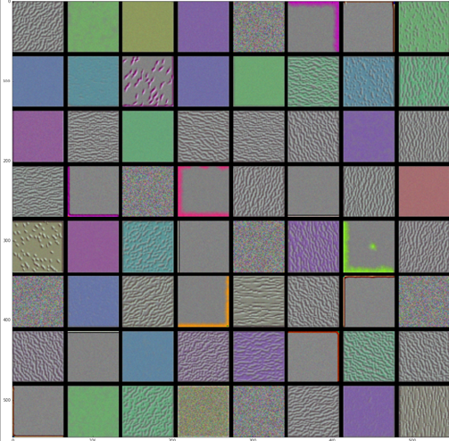

# Visualization

<div style='width:1000px;margin:auto;'>
<details><summary>Visualizing <b>intermediate activations</b></summary>
<p>This consists of displaying the feature maps that are output by various convolution and pooling layers in a network, given a certain input.<br><br>This gives a view into how an input is decomposed into the different filters learned by the network.</p>

<h4>Load the model</h4>
```
# Or simply use the model that you have used recently.
from tensorflow.keras.models import load_model
model = load_model()
model.summary()
```

<h4>Preprocessing a single image</h4>
```
img_path = 'path/to/image.jpg'

from tensorflow.keras.preprocessing import image
import numpy as np

img = image.load_img(img_path, target_size=(150, 150))
img_tensor = image.img_to_array(img)
img_tensor = np.expand_dims(img_tensor, axis=0)
img_tensor /= 255. # Remeber that the model is trained on inputs like that.

print(img_tensor.shape)
# ex. shape is (1, 150, 150, 3)
```

<h4>Display hte test image</h4>
```
import matplotlib.pyplot as plt

plt.imshow(img_tensor[0])
plt.show()
```


<h4>Instantiating a model with one input and multiple outputs (n_conv layers)</h4>
```
from tensorflow.keras import models

# Change the number of 8 based on n_layers in your model.
layer_outputs = [layer.output for layer in model.layers[:8]]
activation_model = models.Model(inputs=model.input, outputs=layer_outputs)

# Running the model in predict mode.
activations = activation_model.predict(img_tensor)
```

<h4>Show individual convolution</h4>
```
first_layer_activation = activations[0]
print(first_layer_activation.shape)
# (1, 148, 148, 32)

# Visualize the features.
plt.matshow(first_layer_activation[0, :, :, 4], cmap='viridis')

# as you can see, this channel encode a diagonal edge detector.
```


<h4>Visualizing every channel in every intermediate activation</h4>
```
layer_names = []
for layer in model.layers[:8]:
	layer_name.append(layer.name)
	
images_per_row = 16

for layer_name, layer_activation in zip(layer_names, activations):
	# Number of features in the feature map
	n_features = layer_activation.shape[-1]
	
	# The feature map has shape (I, size, size, n_features).
	size = layer_activation.shape[1]
	
	# Tiles the activation channels in this matrix.
	n_cols = n_features // images_per_row
	display_grid = np.zeros((size*n_cols, images_per_row*size))
	
	# Tiles each filter into a big horizontal grid.
	for col in range(n_cols):
		for row in range(images_per_row):
			channel_image = layer_activation[0, :, :, col * images_per_row + row]
			# Post-processes the feature to make it visually palatable.
			channel_image -= channel_image.mean()
			channel_image /= channel_image.std()
			channel_image *= 64
			channel_image += 128
			channel_image = np.clip(channel_image, 0, 255).astype('uint8')
			display_grid[col*size:(col+1)*size,
					   row*size:(row+1)*size] = channel_image
					   
scale = 1. / size
plt.figure(figsize=(scale*display_grid.shape[1],
			    scale*display_grid.shape[0]))
plt.title(layer_name)
plt.grid(False)
plt.imshow(display_grid, aspect='auto', cmap='viridis')
```


<p>Things to note in here:</p>
<ul>
<li>The first layer acts as a collection of various edge detectors. At that stage, the activations retain almost all of the information present in the inital picture.</li>
<li>As you go higher, the activations become increasingly abstract and less visually interpretable. They begin to encode higher-level concepts such as “cat ear” and “cat eye.” Higher presentations carry increasingly less information about the visual contents of the image, and increasingly more information related to the class of the image.</li>
<li>The sparsity of the activations increases with the depth of the layer: in the first layer, all filters are activated by the input image; but in the following layers, more and more filters are blank. This means the pattern encoded by the filter isn’t found in the input image.</li>
</details>


<details><summary>Visualizing <b>Convnet Filters</b></summary>
<p>This method displays the visual pattern that each filter is meant to respond to. This can be done with <b>gradient ascent in input space</b>: applying gradient descent to the value of the input image of a convent so as to maximize the response of a specific filter, starting from a blank input image. The resulting input image will be one that the chosen filter is maximally responsive to.</p>
<p>The process as follows:</p>
<ul><li>Build a loss function that maximizes the value of a given filter in a given convolution layer</li>
<li>Use stochastic gradient descent to adjust the values of the input image so as to maximize this activation value</li></ul>

<h4>Defining the loss tensor for filter visualization</h4>
```
from tensorflow.keras.applications import VGG16
from tensorflow.keras import backend as K

model = VGG16(weights='imagenet', include_top=False)
layer_name = 'block3_conv1'
filter_index = 0

layer_output = model.get_layer(layer_name).output
loss = K.mean(layer_output[:, :, :, filter_index])
```

<h4>Obtaining the gradient of the loss with regard to the input</h4>
```
# The call to gradients returns a list of tensors (of size 1 in this case).
# Hence, you keep only the first element --- which is a tensor.
grads = K.gradients(loss, model.input)[0]

# a trick to use to help the gradient-descent go smoothly is to normalize the graident tensor by dividing it by its L2 norm (the square root of the average of the square of the values in the tensor). This ensures that the magnitude of the updates done to the input image is always within the same range.
grads /= (K.sqrt(K.mean(K.square(grads))) + 1e-5)
```

<h4>Fetching Numpy output values given Numpy input values</h4>
```
iterate = K.function([model.input], [loss, grads])

loss_value, grads_value = iterate([np.zeros((1, 150, 150, 3))])
```

<h4>Loss maximization via stochastic gradient descent</h4>
```
input_img_data = np.random.random((1, 150, 150, 3)) * 20 + 128.

step = 1.
# Run gradient ascent for 40 steps.
for i in range(40):
	# computes the loss value and gradient value
	loss_value, grads_value = iterate([input_img_data])
	# Adjusts the input image in the direction that maximizes the loss.
	input_img_data += grads_value * step
```

<h4>Utility function to convert a tensor into a valid image</h4>
```
def deprocess_image(x):
	x -= x.mean()
	x /= (x.std() + 1e-5)
	x *= .1
	
	x += .5
	x = np.clip(x, 0, 1)
	
	x *= 255
	x = np.clip(x, 0, 255).astype('uint8')
	return x
```

<h4>Function to generate filter visualizations</h4>
```
def generate_pattern(layer_name, filter_index, size=150):
	# Builds a loss function that maximizes the activation of the nth filter of the layer under consideration.
	layer_output = model.get_layer(layer_name).output
	loss = K.mean(layer_output[:, :, :, filter_index])
	
	# Computes the gradient of the input picture with regard to this loss
	grads = K.gradients(loss, model.input)[0]
	# Normliazation trick: normlaizes the gradient.
	grads /= (K.sqrt(K.mean(K.square(grads))) + 1e-5)
	# Returns the loss and grads given the input picture.
	iterate = K.function([model.input], [loss, grads])
	# Starts from a gray image with some noise
	input_img_data = np.random.random((1, size, size, 3)) * 20 +128.
	
	# Runs gradient ascent for 40 steps.
	step = 1.
	for i in range(40):
		loss_value, grads_value = iterate([input_img_data])
		input_img_data += grads_value * step
		
	img = input_img_data[0]
	return deprocess_image(img)
	
# Show some pattern
plt.imshow(generate_pattern('block3_conv1', 0))
```


<h4>Generating a grid of all filter response patterns in a layer</h4>
```
layer_name = 'block1_conv1'
size = 64
margin = 5

# Empty (black) image to store results.
results = np.zeros((8*size + 7*margin, 8*size, 7*margin, 3))

for i in range(8): # iterates over the rows of the results grid.
	for j in range(8): # iterates over the columns.
		# generates the pattern for filter i + (j*8) in layer_name.
		filter_img = generate_pattern(layer_name, i+(j*8), size=size)
		
		# Puts the result in the square (i, j) of the results grid.
		horizontal_start = i *size+i*margin
		horizontal_end  = horizontal_start + size
		vertical_start = j * size + j*margin
		vertical_end = vertical_start + size
		results[horizontal_start:horizontal_end, vertical_start:vertical_end, :] = filter_img
		
# Displays the results grid.
plt.figure(figsize=(20, 20))
plt.imshow(results)
```

</details>

<details><summary>Visualizing <b>intermediate activations</b></summary>

</details>
</div>


