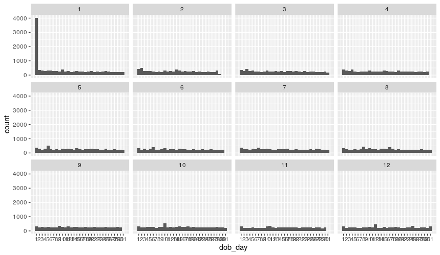
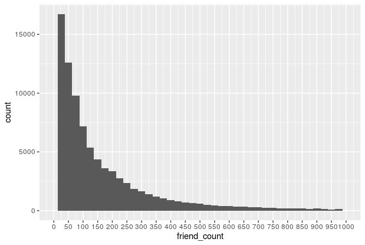
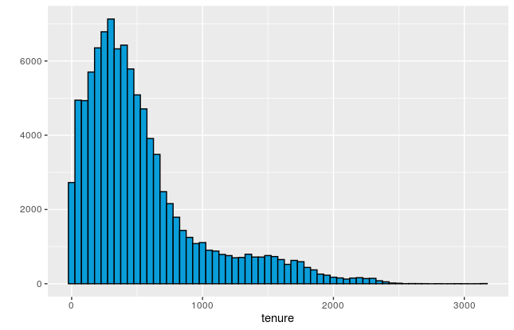
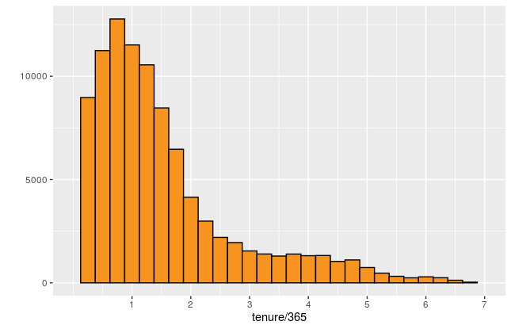
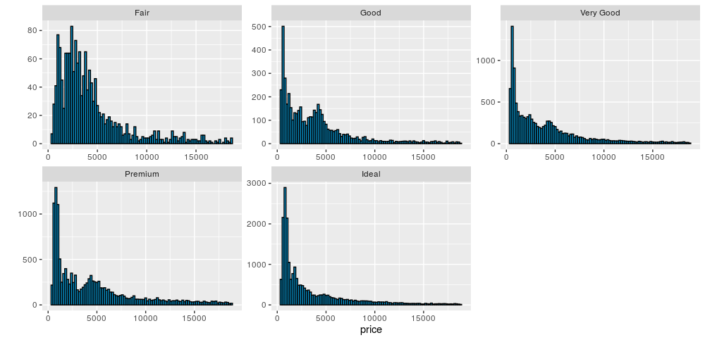
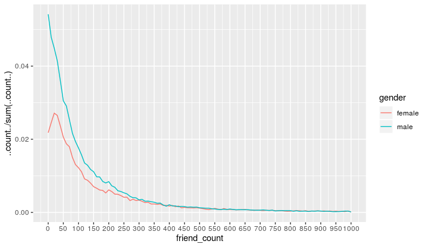
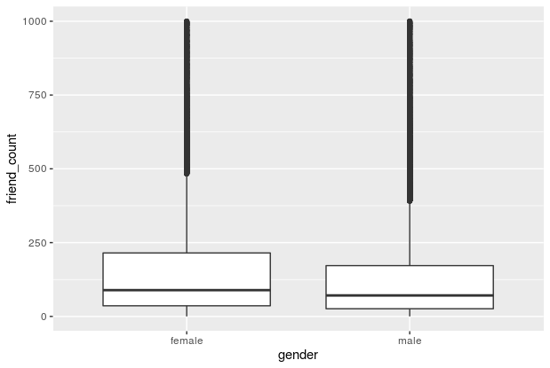
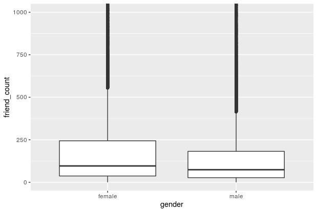

# Data Visualization

<b>Tips & Tricks</b>

<b>Installation</b>

Install <b>ggplot2</b>

~~~
install.packages('ggplot2')
library(ggplot2)
~~~

Install <b>gridExtra</b>

~~~
install.packages('gridExtra')
library(gridExtra)
~~~

<b>Add title for axises</b>

~~~
qplot(data=subset(df, !is.na(www_likes)), x=www_likes,
      geom='freqpoly', color=gender,
      xlab='WWW LIKES (TITLE)',
      ylab='Y TITLE')+
  scale_x_log10()
~~~

1. Explore <b>One</b> Variable</b>

<b>1. Histograms</b>

<b>1.1. using scale_x_continuous()</b>

<h4>1. using qplot()</h4>
~~~
qplot(x=dob_day, data=df) +
  scale_x_continuous(breaks=1:31) +
  geom_histogram(binwidth = 1)
~~~

<h4>2. using ggplot()</h4>
~~~
ggplot(aes(x = dob_day), data = pf) +
  geom_histogram(binwidth = 1) +
  scale_x_continuous(breaks = 1:31)
~~~

<b>1.2. using facet_wrap()</b>

<blockquote>
we use it, to make interaction between 2 variables.
</blockquote>
~~~
qplot(x=dob_day, data=df) + 
	scale_x_continuous(breaks=1:31) + # scale x axis to that limit
	facet_wrap(~dob_month, ncol=3)
~~~
~~~
ggplot(data=df, aes(x=dob_day)) + 
  geom_histogram(binwidth = 1) +
  scale_x_continuous(breaks = 1:31) + 
  facet_wrap(~dob_month)
~~~

<b>1.3. using xlim</b>

~~~
# this
qplot(data=df, x=friend_count, xlim=c(0, 1000))

# or this
qplot(data=df, x=friend_count) + 
  scale_x_continuous(limits = c(1, 1000))
~~~

~~~
# Using ggplot
ggplot(aes(x = friend_count), data = pf) +
  geom_histogram() +
  scale_x_continuous(limits = c(0, 1000))
~~~

<b>1.4. using binwidth</b>

~~~
# 1. using qplot
qplot(x = friend_count, data = pf, binwidth = 25) +
  scale_x_continuous(limits = c(0, 1000), breaks = seq(0, 1000, 50))
  
# 2. using ggplot
ggplot(aes(x = friend_count), data = pf) +
  geom_histogram(binwidth = 25) +
  scale_x_continuous(limits = c(0, 1000), breaks = seq(0, 1000, 50))
~~~

<b>1.5. Omiting NA (Not Applicable)</b>

~~~
#### Using qplot
# First Trial
qplot(data=na.omit(df), x=friend_count, binwidth=10) +
  scale_x_continuous(lim=c(0, 1000), breaks=seq(0, 1000, 50)) +
  facet_wrap(~gender)

# Second Trial
qplot(data=subset(df, !is.na(gender)), x=friend_count, binwidth=25) +
  scale_x_continuous(lim=c(0, 1000), breaks=seq(0, 1000, 50)) +
  facet_wrap(~gender)
~~~

~~~
#### Using ggplot
ggplot(aes(x = friend_count), data = subset(pf, !is.na(gender))) +
  geom_histogram() +
  scale_x_continuous(limits = c(0, 1000), breaks = seq(0, 1000, 50)) +
  facet_wrap(~gender)
~~~

<b>1.6. Color & Fill bars</b>

<a href="https://ggplot2.tidyverse.org/reference/theme.html"><b>Doc about Themes</b></a> 

~~~R
#### Using qplot
# Note: The I() functions stand for 'as is' and tells qplot to use them as colors.

qplot(data=df, x=tenure, color=I('black'), fill=I('#099DD9'), binwidth=50)

qplot(data=df, x=tenure/365, binwidth=.25,
      color=I('black'), fill=I('#F79420')) +
  scale_x_continuous(breaks=seq(1, 7, 1), limits=c(0, 7))
~~~

~~~
#### Using ggplot
ggplot(aes(x = tenure/365), data = pf) +
  geom_histogram(binwidth = .25, color = 'black', fill = '#F79420')
~~~

<b>1.7. Multiple Plots in one image</b>

~~~
library(gridExtra)

# Using 1. qplot:
p1 <- qplot(data=df, x=friend_count)
p2 <- qplot(data=df, x=sqrt(friend_count))
p3 <- qplot(data=df, x=log1p(friend_count))

# NOTE: the x axis here, we have log scale not the actual counts.

grid.arrange(p1, p2, p3, ncol=1)
~~~

~~~
# Using 2. ggplot
p1 <- ggplot(data=df, aes(x=friend_count)) + geom_histogram()
p2 <- p1 + scale_x_log10()
p3 <- p1 + scale_x_sqrt()

# NOTE: the x axis here, will have the actual counts not the log counts.

grid.arrange(p1, p2, p3, ncol=1)
~~~

<b>1.8. Scale each plot freely, when having multiple plots</b>

~~~
qplot(data=diamonds, x=price, binwidth=200,
      color=I('black'), fill=I('#099DD9'))+
  facet_wrap(~cut, scales = 'free')
~~~

<b>2. Frequency Ploygon [KDE]</b>

<b>2.1 Normal one</b>

~~~
# using qplot
qplot(data=subset(df, !is.na(gender)), x=friend_count,
      binwidth=10, geom='freqpoly', color=gender) +
  scale_x_continuous(lim=c(0, 1000), breaks=seq(0, 1000, 50))
~~~

<b>2.2 Showing proportion instead of counts</b>

~~~
# using qplot
qplot(data=subset(df, !is.na(gender)), x=friend_count, y= ..count../sum(..count..),
      binwidth=10, geom='freqpoly', color=gender) + 
  scale_x_continuous(lim=c(0, 1000), breaks=seq(0, 1000, 50))
~~~

~~~
# Using ggplot
ggplot(aes(x = www_likes), data = subset(pf, !is.na(gender))) +
  geom_freqpoly(aes(color = gender)) +
  scale_x_log10()
~~~

<b>3. Box Plot</b> [cat vs. num]

<b>3.1 Regular</b>

~~~
# using qplot
qplot(data=subset(df, !is.na(gender)), x=friend_count,
      binwidth=10, geom='boxplot', color=gender) +
  scale_x_continuous(lim=c(0, 1000), breaks=seq(0, 1000, 50))
~~~

<b>3.2 Using coord_cartesian()</b>

~~~
# using coord_cartesian doesn't change the values of median and quantiles unlike scale_y_continuous()
qplot(data=subset(df, !is.na(gender)), y=friend_count, x=gender,
      geom='boxplot')+
  coord_cartesian(ylim=c(0, 1000))
~~~

2. Explore <b>Two</b> Variables:

1. <b>Scatter Plot</b> [num vs. num]

~~~
# The default is scatter plot when using qplot.
qplot(x=age, y=friend_count, data=df)

# Using ggplot
ggplot(aes(x = age, y = friend_count), data = df) +
  geom_point()

~~~

